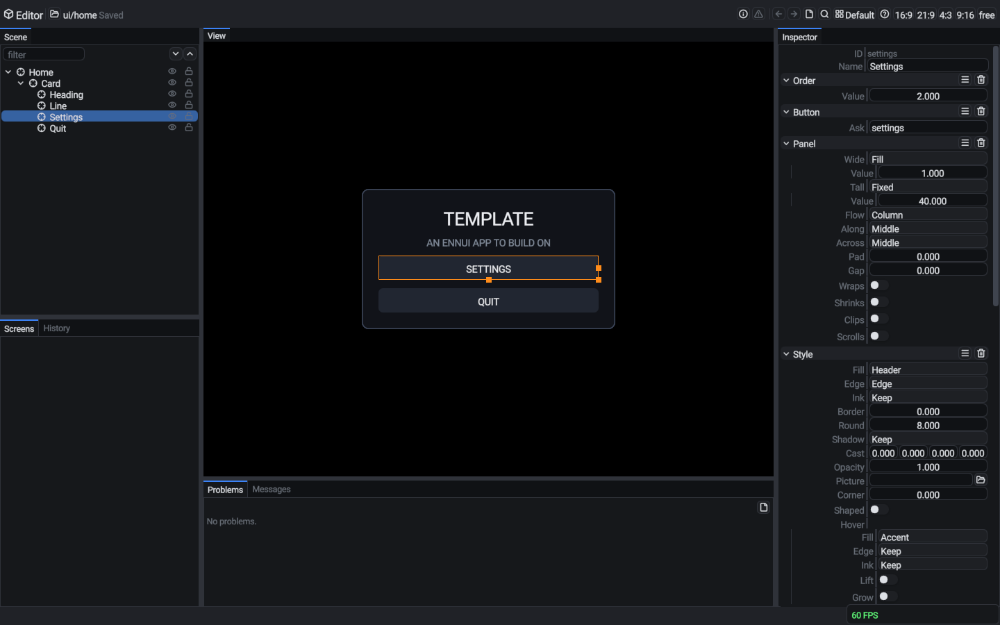
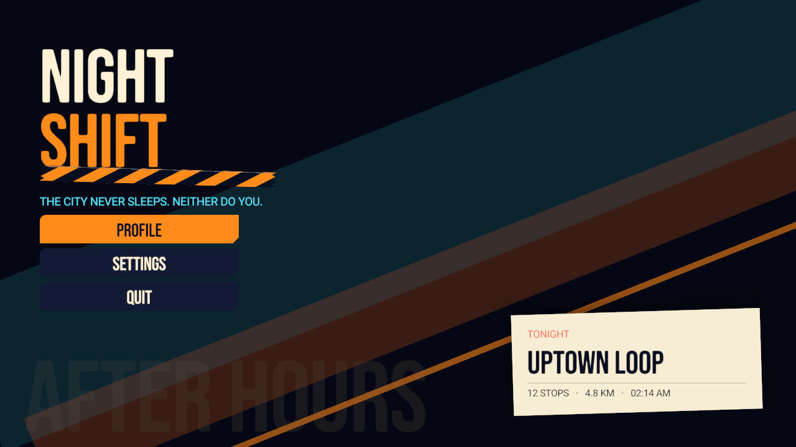
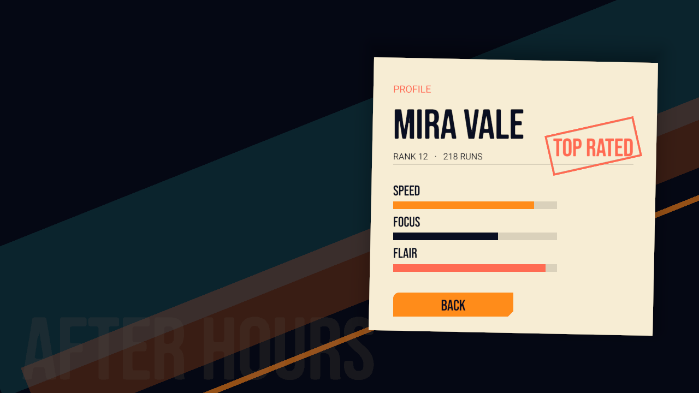
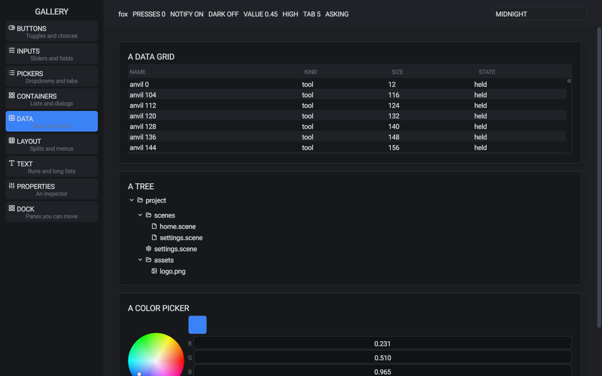
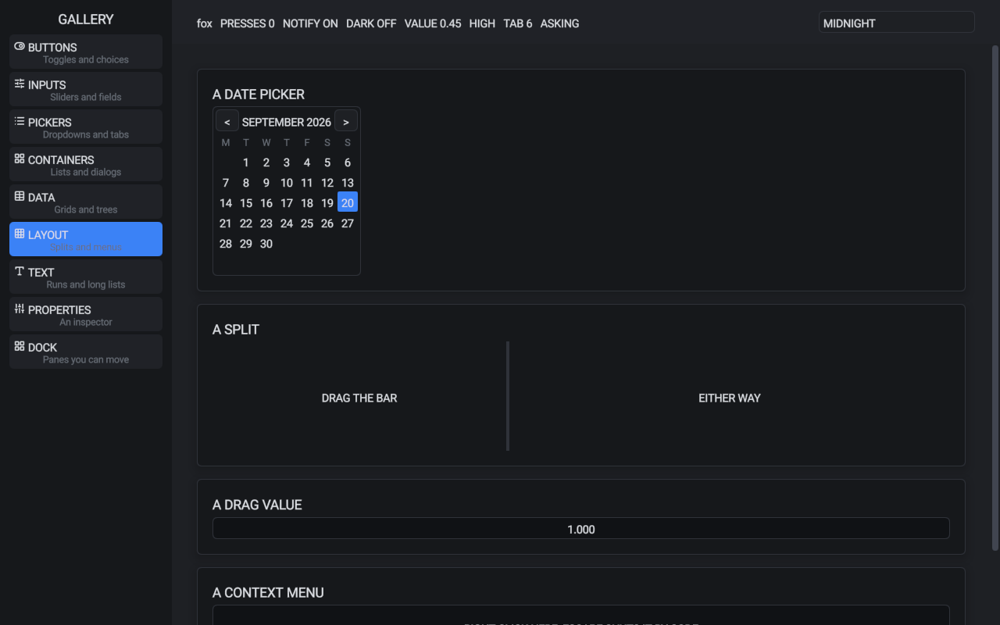
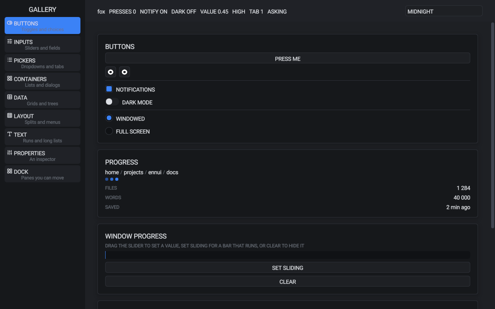
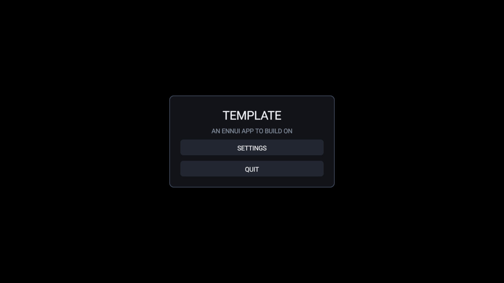

# ennui

A retained UI framework in data-oriented Rust, with a scene editor that Claude can drive.

Screens are scene files (`project/scenes/ui/*.scene`). An app opens them by name, fills the resources they bind to, and answers the asks their buttons send. The editor writes those files: you edit with the mouse, and Claude edits the same scene live through a local socket. Everything is plain Rust over an ECS (components, resources and systems), with no `unsafe` and no C dependencies beyond the OS bindings under `winit` and `wgpu`.



| | |
| --- | --- |
|  |  |
|  |  |
|  |  |

## Who this README is for

ennui is made to be used with a coding agent such as [Claude Code](https://claude.com/claude-code). You say what you want on a screen; the agent edits the scene in the open editor, writes the Rust that fills and answers it, and checks its work with pictures of the window. This README is written so that an agent can read it and work from it, and so it is exact about paths, commands and file formats.

You can also write everything by hand. The scenes are plain text, the code is plain Rust, and the editor works without an agent.

**Agents:** read [`RULES.md`](RULES.md) (how the code is written) and [`INTERFACE.md`](INTERFACE.md) (how screens behave) before you change anything. In an app made from the template, its `CLAUDE.md` imports both. Use the `editor` skill to change screens through the open editor rather than editing scene files on disk, so the user sees each change and can undo it.

## From a fresh clone to your own app

1. Install [Rust](https://rustup.rs) and [just](https://github.com/casey/just). The toolchain is pinned in `rust-toolchain.toml`, and `rustup` installs it on the first build. On Linux, also install a Vulkan driver for your GPU. ennui runs on Windows, macOS and Linux, and in the browser through WebGPU; support for Android is planned.
2. Clone ennui and try it:

   ```
   git clone https://github.com/matthewjberger/ennui
   cd ennui
   just run gallery        # a tour of every widget, with docked panes and four themes
   just run showcase       # a styled launcher: sliding menus, a display font, filling bars and a stamp
   just run editor         # the scene editor, on the template's project
   ```

   The first build compiles the `ennui` command line tool and the crates, and takes a few minutes.
3. Make your app. `just new` copies `template/` into a new git repository at the folder you name, renames it, points it at this clone with a relative path, and makes a first commit:

   ```
   just new ../my-app
   cd ../my-app
   just run                # a home screen and a settings screen
   just edit               # the editor, on the app's screens
   ```

   Keep the app and the ennui clone where they are relative to each other: the app builds the ennui crates from the clone by that path.
4. Claude Code needs no setup. The skills are in `.claude/skills/` and the editor hook is in `.claude/settings.json`, and Claude Code loads both when you open this clone or your app. `just new` and `just sync` copy the skills into your app and point its hook at this clone.

   Run `just run editor` (or `just edit` in your app) once before you start: the prompt hook calls the editor's client from `target/play`, so it must be built before the hook can report what you do in the editor.
5. Open Claude Code in your app's folder, open the editor with `just edit`, and ask for a screen, for example "add a pause menu with resume, settings and quit". Claude builds it in the editor while you watch, writes the code that opens it and answers its buttons, and takes a picture to check it.
6. Ship it with `just export`. It builds the app with the `export` profile (full optimization, stripped) and puts the program beside copies of `project/` and `assets/` in `target/shipped/<app>`. Ship that folder as it is; the program finds its project beside it.

An app repository holds:

| Path | Holds |
| --- | --- |
| `src/` | Start-up, the app's state and the systems that open screens and answer asks |
| `project/scenes/ui/` | The screens, and the theme scene they draw with |
| `project/scenes/text/` | The text tables: every word the screens show |
| `project/settings.scene` | App settings, such as the theme |
| `assets/` | Fonts and pictures, which the screens name as `assets/...` paths |
| `project/.ennui/` | Files the app and the editor generate (the component list, the editor's port and journals); keep it out of git |
| `CLAUDE.md` | The agent's instructions for the app; it imports ennui's `RULES.md` and `INTERFACE.md` |

## Commands

In the ennui clone:

| Command | Does |
| --- | --- |
| `just run <app> [args]` | Runs an app by package name: `gallery`, `editor`, `showcase` |
| `just trace <app>` | Runs with Chrome tracing and writes `trace.json` in the current folder; open it in [Perfetto](https://ui.perfetto.dev) |
| `just pick [query]` | Lists the apps and runs the one you pick |
| `just web <apps>` | Builds apps for the browser into `target/site`: the first app is the main page, with a button to each of the others; the GitHub Pages workflow deploys the gallery with a button to the showcase this way |
| `just serve <apps>` | Builds apps for the browser and serves `target/site` at http://127.0.0.1:8080 |
| `just new <folder>` | Makes a new app repository from `template/` |
| `just lint` | Checks the format and runs clippy, with warnings as errors, on every crate and on the tool |
| `just fmt` | Formats every crate and the tool |

In an app made with `just new`:

| Command | Does |
| --- | --- |
| `just run` | Runs the app |
| `just edit [screen]` | Opens the editor on the app's project, at a screen such as `ui/settings` |
| `just trace` | Runs with Chrome tracing |
| `just export` | Builds for release into `target/shipped/<app>` |
| `just check` | Runs clippy, then a play build |
| `just lint`, `just fmt` | Check and format the app's crates |
| `just sync` | Copies ennui's workspace settings (crate paths, profiles, lock, toolchain) after they change |

`just run` builds the crates as one shared library (`ennui-dylib`) where an app supports it, so a change to the app does not relink the whole framework. Every recipe is a one-line call to the `ennui` tool in `tools/ennui`.

The apps also take these flags after the recipe: `--size 1280x720`, `--capture <file.png>` with `--capture-frame <n>` (write a picture of a frame, then close), `--step <seconds>` (the same time step each frame, so runs repeat), `--click X,Y@frame`, `--drag Left:X,Y>X,Y@from-to`, `--press KeyJ@frame` and `--type <text>@frame` (scripted input), `--frames <n>` (report frame times), and `--describe` (write the component list for the editor, then close).

## Architecture

ennui is a stack of small crates. Each crate keeps its data in components and resources and its behavior in systems, and adds them to the app through a `resources` function and a `systems` function in its `plugin.rs`.

| Layer | Crates | What it does |
| --- | --- | --- |
| App core | `ennui`, `ennui-ecs`, `ennui-reflect` | The ECS storage, the schedule and the app loop. Reflection gives each component and resource a name, fields and a description, so scenes, bindings and the editor can read and write them by name |
| Platform | `ennui-platform`, `ennui-window`, `ennui-input`, `ennui-watch` | The window and its events (`winit`), time, keyboard and mouse state, the command line, actions and their bindings, and file watching for live reload |
| Documents | `ennui-document`, `ennui-scene`, `ennui-lines`, `ennui-screens`, `ennui-bind`, `ennui-state`, `ennui-animation` | Scene files read into entities (with layers and prefabs) and written back, the parent tree, text tables, screens opened by name, bindings from sources to fields, app states, and clips |
| Interface | `ennui-ui`, `ennui-ui-controls`, `ennui-ui-focus`, `ennui-ui-repeat`, `ennui-ui-dock`, `ennui-ui-icons`, `ennui-ui-rate`, `ennui-text` | Layout and painting of hosts and panels, the controls, focus and navigation, repeated lists, docking, the Lucide icon font, a frame-rate card, and text shaping with a glyph atlas (`cosmic-text`) |
| Rendering | `ennui-render`, `ennui-pictures`, `ennui-quads`, `ennui-wgpu`, `ennui-wgpu-overlay` | Pictures and their upload into one texture array, the quad list that layout paints, and the `wgpu` renderer with the overlay pass that draws every quad in one instanced draw |
| Glue | `ennui-sets`, `ennui-dylib`, `ennui-trace` | The plugin sets that apps start from (`world` and `interface`), the whole framework as one shared library, and tracing |

### The frame

The window drives the app loop. Each frame runs the schedule's stages in order:

1. **Startup** runs once, before the first frame.
2. **Input** reads the window's events into `Input` and lets the interface claim the pointer and the keys it uses before the app's actions read them.
3. **Update** runs the app's logic: screens open and close, asks are answered, bindings copy sources into fields, controls react, and documents load and reload.
4. **Render** lays out what changed, paints quads, and uploads the glyph sheet and pictures.

Then the renderer uploads the frame's data and draws it. Systems declare what they read and write (`Res`, `ResMut`, `View`, `Peek`, `Mut`, `Glance`, `Later`), so the schedule runs systems that do not conflict in parallel. `before(a, b)` orders two systems or groups, and each plugin names its groups so other plugins can order against them.

### From a scene file to pixels

1. `ennui-screens` opens `scenes/ui/<name>.scene`. `ennui-document` reads the file and spawns one entity for each row, with the components its leaves name, through reflection.
2. `ennui-bind` resolves each `Bind` entry each frame that its source changes, and writes the field: words from a text table, a value from a resource, or an item's field. Entries with `back true` write user changes back to the source.
3. `ennui-ui` builds a node tree from `Host`, `Panel`, `Pin` and `Text`, measures it (text through `ennui-text`), places each node, and stores a `Rect` on each element. Only the parts whose data changed are laid out again.
4. The paint step turns each element's `Style` and `Text` into quads: rounded or nine-sliced rectangles, shadows and glyphs, each with a clip and a depth.
5. The overlay pass sorts the quads by depth and draws them in one instanced draw, sampling pictures and the glyph sheet from one bound texture array.

The editor is an ennui app too. It loads the same scenes into its own view, keeps an undo history for each scene, writes your edits and Claude's edits to separate layers, and serves a line-based command protocol on a localhost port, which `editor-edit` speaks.

## How an app works

A screen is a scene. This is part of the template's settings screen:

```
entity settings "Settings"
    Host
    Host.sizing Tall
    Host.modal true
    Panel.wide Fill[1]
    Panel.tall Fill[1]

entity scale "Scale"
    parent card
    Slider.low 0.5
    Slider.high 2
    Panel.wide Fill[1]
    Bind.entries [{target "Slider.value" source "{Interface.scale}" format Plain back true}]

entity back "Back"
    parent card
    Button.ask "back"
    Style.fill Header
    Style.hover.fill Accent
    Bind.entries [{target "Text.words" source "{text.ui.back}" format Plain back false}]
```

The app opens the screen by name and answers its asks. The slider needs no code, because its binding writes `Interface.scale` in both directions.

```rust
pub fn choose(asks: Res<Asks>, mut screen: ResMut<State<Screen>>, mut exit: ResMut<Exit>) {
    if asked(&asks, "settings") {
        screen.next = Some(Screen::Settings);
    }
    if asked(&asks, "back") {
        screen.next = Some(Screen::Home);
    }
    if asked(&asks, "quit") {
        exit.0 = true;
    }
}
```

Start-up adds the plugin sets, points the scene documents at the project folder, and adds the app's own state and systems. This is the template's `main`, shortened:

```rust
fn main() {
    let mut app = app::new();
    platform::resources::<NoArguments>(&mut app);
    schedule(&mut app, platform::systems());
    sets::world(&mut app);
    sets::interface(&mut app);
    ennui_document::plugin::resources(&mut app);
    schedule(&mut app, ennui_document::plugin::systems());
    get_mut::<Level>(&mut app.resources).root = project_folder(env!("CARGO_MANIFEST_DIR"));
    state::resources(&mut app, Screen::Home);
    schedule(&mut app, state::systems::<Screen>());
    schedule(
        &mut app,
        vec![
            on_turn::<Screen, _>(screens::show),
            on(Stage::Update, screens::choose),
        ],
    );
    run(&mut app);
}
```

To let a screen bind to the app's own data, make the resource reflected, register it, and schedule its settle step:

```rust
ennui::tuning! {
    #[derive(Clone, PartialEq, Debug, ennui::Reflect)]
    #[reflect(about = "The player's progress, shown on the profile screen")]
    pub struct Progress {
        #[reflect(about = "Runs finished")]
        runs: u32 = 0,
    }
}

insert_resource(&mut app, Progress::default());
resource::<Progress>(&mut app.resources);
schedule(&mut app, vec![settling::<Progress>()]);
```

A scene can then bind `{Progress.runs}`, and the editor lists `Progress` with its fields after the app's next start. Without the settle step the app stops at start and names the missing step. The `about` lines are what the editor and Claude read to learn what each field means.

The parts:

- **Hosts and layout.** The root of a screen holds `Host`. `Host.sizing Tall` lays out against a 1280 by 720 reference and scales with the window height. `Host.layer` stacks screens, and `Host.modal` keeps focus inside one. Each element holds `Panel`: a width and height as `Fixed`, `Fill` or `Hug`, a row or column flow, alignment, pad and gap, and clipping or scrolling. `Pin` takes an element out of the flow and places it at a share of its parent, nudged in pixels, with its own pivot. `Turn` rotates an element, and `Order` sorts siblings.
- **Look.** `Style` sets the fill, edge, border, rounding, shadow, opacity and a picture, which is nine-sliced when it has a corner size. With `Style.shaped`, the picture becomes the element's shape. Each mood (hover, press, focus, off and lit) changes the fill and ink, and can grow or lift the element. `Text` sets the words, size, color, font, alignment, wrapping and an outline.
- **Themes.** A `Theme` entity holds the colors (ink, faint, panel, header, edge, accent, input and any named colors), the text sizes and the font. Styles name theme colors (`Accent`, `Named["beacon"]`) instead of their own values, so one theme scene restyles every screen. The gallery switches between four themes while it runs.
- **Bindings.** `Bind.entries` fill a field from a source template: `{text.<table>.<key>}` for a text table entry, `{Resource.field}` for any reflected resource, and `{item.field}` for a list item. The formats are `Plain`, `Whole`, `Decimals[n]` and `Percent`. With `back true`, the field writes back to its source, as a slider or an entry does. A field of any reflected type can be bound, so a layout value such as `Panel.wide` can follow app data. `Samples` gives sample values for the editor to show, because the editor never reads live data.
- **Text tables.** Every word lives in `project/scenes/text/<table>.scene`, with one `Line.words` entity for each key.
- **Assets.** Fonts and pictures live in the app's `assets/` folder, beside `project/`, and scenes name them as `assets/...` paths, such as `Text.font "assets/fonts/display.ttf"` or `Style.picture "assets/textures/ui/button.png"`.
- **Controls.** `Button` (with an ask), `Toggle`, `Slider`, `Entry`, `Dropdown` and `Tabs` are components on elements. `Repeat` makes one row for each item of a bound list, from its first child or a prefab scene, and draws only the visible rows of a scrolling list. The gallery builds on these parts with data grids, trees, date and color pickers, splits, drag values, context menus, dialogs, toasts and a command palette. `ennui-ui-dock` adds panes in splits and tab groups that the user can drag, maximize and save.
- **Asks and input.** A button press or a focus poke adds the button's ask to `Asks`, and the app reads it with `asked`. The keyboard and the mouse both work. Focus moves to the nearest element in the pressed direction, and the pointer moves the focus too. `ennui-input` maps keys and mouse buttons to app actions, lets the user rebind them, and saves the bindings.
- **Touch and the phone keyboard.** One finger taps, drags sliders sideways, and scrolls panels vertically with a fling that slows down. On the web, a tap on a text field opens the phone's keyboard.
- **Platform services.** `ask_open` shows the file picker and sends the file's name and bytes as a `FileOpened` event; `ask_save` shows a save dialog (a download on the web); `open_url` opens a link in the browser; `write_clipboard` and `Input.pasted` carry the clipboard. On the web, a dropped file goes into the `Shelf` as `dropped/<name>` and arrives as `FileDropped`.
- **Motion.** A `Sequence` entity is an authored clip. Its `Channel` children each key one field with eases, and `Play` plays it. The editor's Timeline pane edits clips. For motion that follows app state, a system writes a reflected resource each frame and the scene binds to it. The showcase slides its menus and fills its bars this way.
- **Screens and state.** `open_screen` and `close_screen` from `ennui-screens` load and unload screens by name. A screen can have several instances, each with a subject entity for its bindings. `ennui-state` runs systems when the app's state changes.
- **Live reload.** Screens, text tables and themes reload while the app runs, so an edit in the editor shows in the running app at once.

## The editor

`just edit` (or `just run editor` in this repository) opens the editor on a project. In the editor you can:

- choose elements in the view or in the scene tree, drag them to change `Pin.nudge` or their order, and resize them with handles
- edit every component in the inspector, with undo and redo for each scene
- check a screen at 16:9, 21:9, 4:3 or 9:16, and draw other screens over it read-only
- edit every word in the Text pane, and clips in the Timeline pane
- see binding, text table and load problems in the Problems pane
- see a theme scene as a sheet of every control in every state
- make prefabs: elements kept in their own scene and used by many screens
- leave notes on elements for Claude, and undo each change Claude makes from its card

Your edits go to a user layer (`<scene>.user.scene`) that is stronger than Claude's layer, so neither of you overwrites the other.

The skills:

| Skill | Use |
| --- | --- |
| `editor` | The guide to screens, text tables and themes, and the command reference for driving the editor through `editor-edit` |
| `new-app` | Makes an app from the template |
| `audit` | Checks code against the design rules in `RULES.md` |
| `list-skills` | Lists the skills |

## Design rules

ennui keeps to strict rules, written for people and for agents:

- [`RULES.md`](RULES.md) covers the code. The design is data-oriented: data lives in components and resources, behavior lives in systems, and functions are free functions over that data. There is no `unsafe`, no global state, no comments in Rust and no abbreviations.
- [`INTERFACE.md`](INTERFACE.md) covers the screens: layout against a reference size, one theme, focus and input, motion timing, flows, settings and readability.

## Repository layout

| Folder | Holds |
| --- | --- |
| `crates/engine` | The app core and ECS, reflection, scenes and documents, text, data binding, text tables, screens, input, animation, state and tracing |
| `crates/rendering` | The renderer, the overlay pass that draws the interface, pictures, and the window |
| `crates/ui` | The retained interface and its controls, dock, focus, icons, frame-rate card and repeat lists |
| `apps/gallery` | Every widget on one screen |
| `apps/editor` | The scene editor and its socket client |
| `examples` | Example apps; `showcase` styles a launcher with its own theme, font and pictures, and animates it through bound resources |
| `template` | The starter app that `just new` copies |
| `tools/ennui` | The command line tool behind every `just` recipe |
| `.claude` | The Claude Code skills and the editor hook |
| `docs` | The screenshots in this README |

## Contributions

ennui does not accept contributions: pull requests are not merged. You are free to fork it under the license.

## License

Licensed under either of [Apache License, Version 2.0](LICENSE-APACHE) or [MIT license](LICENSE-MIT) at your option. The bundled fonts keep their own licenses: Roboto (Apache 2.0), Lucide (ISC, with parts under MIT) and Bebas Neue in the showcase (SIL Open Font License), each with its license file beside the font.
